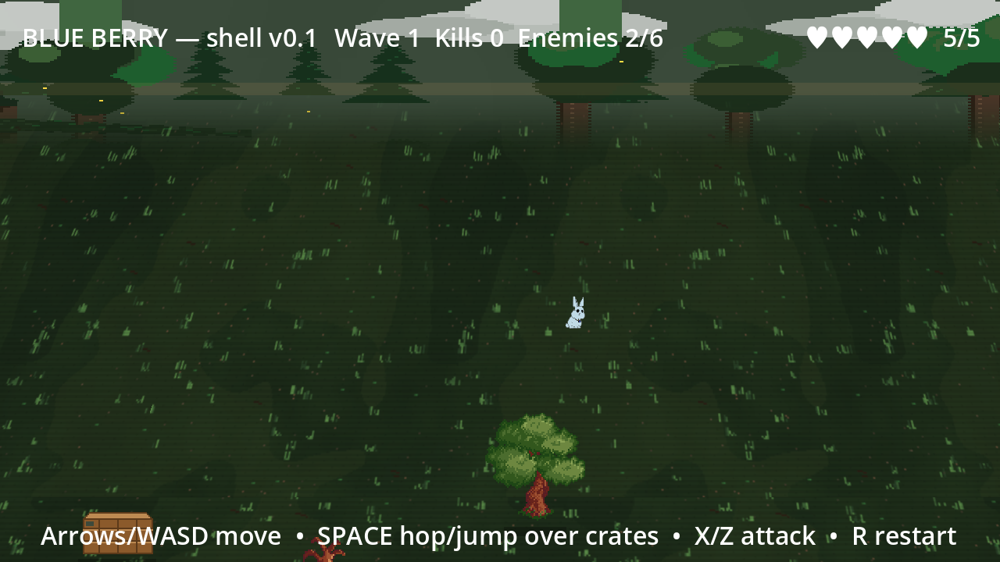

# Blue Berry — Godot Shell v0.2

Pixel-art **Beat 'em Up / Belt-Scroll Brawler** (Golden Axe-like). Rabbit hero hops to dodge encircling berries, mobs with front swipe. Now with Start Splash + Game Over + restart loop.

## Showcase



Title, ridge, and forest-floor captures with retake instructions live in [`docs/showcase/SHOWCASE.md`](docs/showcase/SHOWCASE.md).

## Quick Start

| Task | Command |
|------|---------|
| Play | `godot --path <repo>` or VS Code → `Blue Berry: Launch Project (F5)` |
| Editor | `godot --path <repo> -e` |
| Headless Verify | `godot --headless --path <repo> --quit --verbose`, filter `WARNING` — expect 0 (per-OS paths in `MEMORY.md` §1) |

1. Open the repo root as folder in VS Code (uses `.vscode/settings.json` `godotTools.editorPath.godot4`).
2. Press **F5** → splash `BLUE BERRY` → **SPACE** or **START** → play.

## Controls

- **Move:** Arrow Keys + WASD (8-dir normalized, `130 px/s`)
- **Hop / Dodge:** `Space` — i-frames `0.22s`, `64px`, `cooldown 0.45s` (`player.gd:10`)
- **Mob Attack:** `X` or `Z` — `10×6.5` front swipe, hitstop `0.05s`
- **Game Over:** `SPACE`/`R` → Restart (reload) • `ESC` → Menu (splash) • `ESC` in game → Quit

## What’s Built (v0.2)

- `scenes/Player.tscn` + `scripts/player.gd` — `IDLE/RUN/HOP/ATTACK/HURT/DEAD`, hop `set_deferred`, attack `hitstop`, `5 HP` hearts.
- `scenes/Enemy.tscn` + `scripts/enemy.gd` — `IDLE/CHASE/ATTACK/HURT/DEAD`, `detection 220 lose 320 attack 22`, `sep steer`, `3 HP`, `1.1s` cooldown.
- `scenes/Main.tscn` + `scripts/main.gd` — `y_sort` `2400×900` arena walls, `Spawner max6 2.2s` ring, `GameState START/PLAYING/GAME_OVER`, HUD `♥/Wave/Kills`.
- `scenes/Obstacle.tscn` + `scripts/obstacle.gd` — jump-over crate/rock/log plus imported forest rocks/trees (layer 32, hop clears).
- `scenes/StartScreen.tscn` + `scripts/start_screen.gd` — `ALWAYS` dim `0.92`, centered `220×44 START`, `SPACE/ENTER` emits `start_game`.
- `scenes/GameOverScreen.tscn` + `scripts/game_over_screen.gd` — `ALWAYS` pop `Wave • Kills`, `RESTART`/`Menu`, `SPACE/R`.
- `project.godot` — `640×360 → 1280×720 canvas_items Nearest`, input `hop/attack`.
- Docs: `GDD.md` (pitch) + `SPEC.md` (canonical) + `MEMORY.md` (runbook) + `PLAN.md` (roadmap) + `.opencode/AGENTS.md` (agent memory).

## Documentation

| File | Purpose |
|------|---------|
| `GDD.md` | High-level pitch + tuning checklist |
| `SPEC.md` | Canonical spec — engine, input, player/enemy/spawner/scene tree, physics layers |
| `MEMORY.md` | Runbook — how to run, boot flow (frame 0), file UIDs, art pipeline, error fixes |
| `PLAN.md` | Forward roadmap — Sprints 1-4 (art, combo, parallax, nav) |
| `.opencode/AGENTS.md` | Agent memory — repo structure + contracts |
| `COPILOT_INSTRUCTIONS.md` | Copilot usage for GDScript |
| `.vscode/` | `settings.json` `launch.json` (`godot` port 6007) `tasks.json` headless check |

Add features by editing `SPEC.md` + `PLAN.md` first, then `scenes/*.tscn` (keep `load_steps = ext+sub` order) + `scripts/*.gd` (snake_case, `@onready`, signals). Verify `Godot --headless --quit → 0 WARNING` before commit.

## Art Swap

Player art is wired (`blueberry_1.png` → `SpriteFrames` `idle/run/hop/attack/hurt`, `ColorRect` fallback kept); Enemy still uses placeholder rects. To swap enemy art:
1. Import enemy sheet → `assets/sprites/enemy.png` `Filter Nearest Mipmap Off`.
2. `Enemy.tscn` → `AnimatedSprite2D` → `SpriteFrames` → add frames per name (`idle/run/attack/hurt`).
3. Keep hitboxes (`Hurtbox 14×18`, `Hitbox 22×14 at 14,-9`) — retune if wider.
4. `Godot --headless --path . --import` → check `*.import` UID matches `ext_resource`.

Tuning: `GDD.md:10` + `player.gd:10`/`enemy.gd:9` exports.

## Project Structure

```
BlueBerry/
├── project.godot + icon.svg + default_env.tres
├── GDD.md SPEC.md MEMORY.md PLAN.md README.md
├── COPILOT_INSTRUCTIONS.md .gitignore .gitattributes
├── .opencode/AGENTS.md package.json
├── .vscode/ settings.json launch.json tasks.json extensions.json
├── assets/sprites/ assets/environment/ assets/sfx/
├── scenes/Main.tscn Player.tscn Enemy.tscn StartScreen.tscn GameOverScreen.tscn
└── scripts/main.gd player.gd enemy.gd start_screen.gd game_over_screen.gd
```

Third-party art: `assets/environment/kipper_falcon/isometric_forest/` contains selected runtime PNGs from KipperFalcon's Godot Store pack. Keep its `ASSET_NOTES.md` and original `README.txt`; do not repackage it as a standalone asset collection.

## Git

- **First clone:** `git clone <url> BlueBerry` → `godot --headless --path BlueBerry --import` (per-OS paths in `MEMORY.md` §1) → `git log --oneline`.
- **Branching:** `main` is playable shell (`v0.2`); feature branches `feat/<name>`; commit `SPEC.md` + `MEMORY.md` with every mechanic change.
- **Ignore:** `.godot/` + `export/` + `*.tmp` (keep `*.import` for UID stability) — see `.gitignore`.

## Next Steps

- Sprint 1: Rabbit `16×24 @2×` sheet, `Enemy` skin, `hitstop` + `flash`, SFX.
- Sprint 2: `3-hit combo` + `hop-cancel`, `blueberry pickup`, spawn ramp.
- Sprint 3: `TileMap` arena, `parallax`, `pause menu`.
