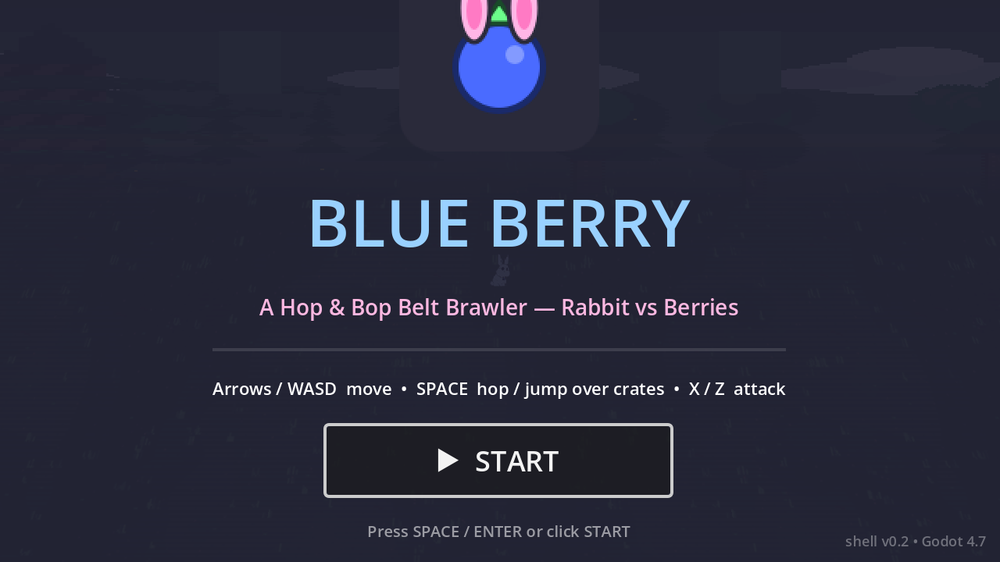
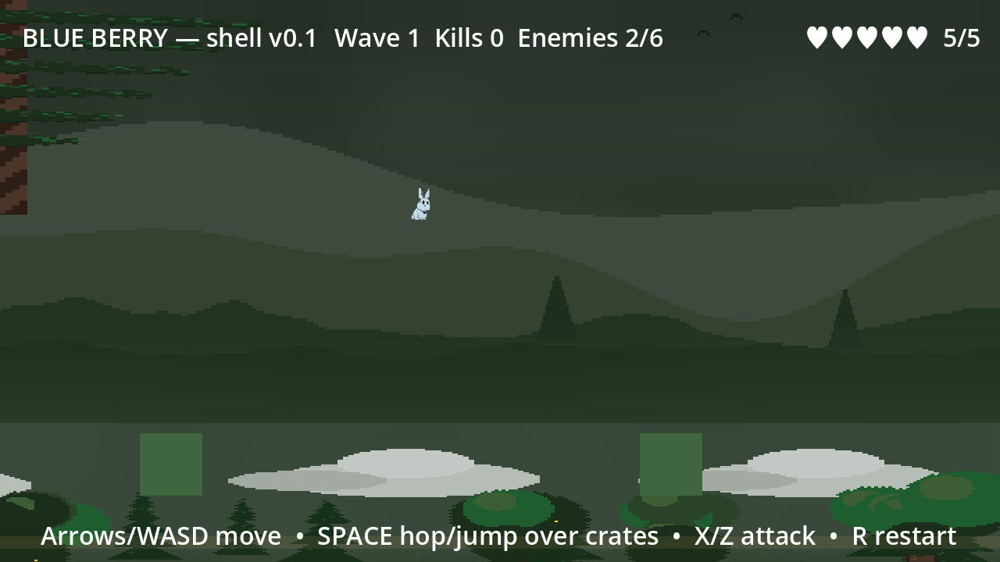
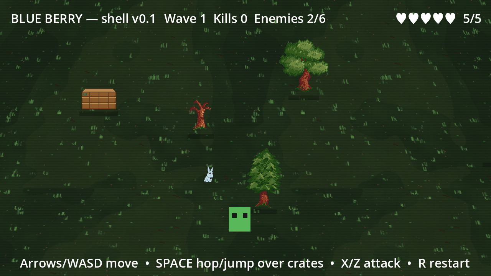

# Blue Berry — Showcase

In-game captures taken from the running project (1280×720). Retake anytime with:

```sh
Godot --path . --resolution 1280x720 -s tools/screenshot.gd
```

A window opens briefly while it captures, then quits by itself. The four
shots below regenerate in place — keep them current when the look changes.

## Title screen — `shot-title.png`



Splash flow: dim overlay, icon, START button, controls hint. First frame a
player sees; keep readable at 640×360.

## Forest gameplay — `shot-forest.png`


The core look: dusk-gradient backdrop, midground treeline, world-anchored
near trees on the ridge, tiled forest floor, HUD (hearts, wave/kills), rabbit
at play scale. If this shot ever shows a flat grey band where the sky should
be, a parallax `TextureRect` lost its designed frame — see the `NEVER assign
.position` rule in `scripts/background.gd`.

## Ridge from below — `shot-sky.png`



Camera at the top of the arena: mountain ridges, treetop band with lone
pines, birds, clouds, and the midground forest rising to meet the ridge.
Proves the tall-sky coverage (`SkyMountains -560..56`) has no gaps.

## Forest floor — `shot-ground.png`



Camera low: KipperFalcon broadleaf/pine obstacles, crate, enemy placeholder,
rabbit at 0.35 scale, ground shader with grass tufts. Reference framing for
obstacle readability (shadows on, silhouettes distinct from the floor).
